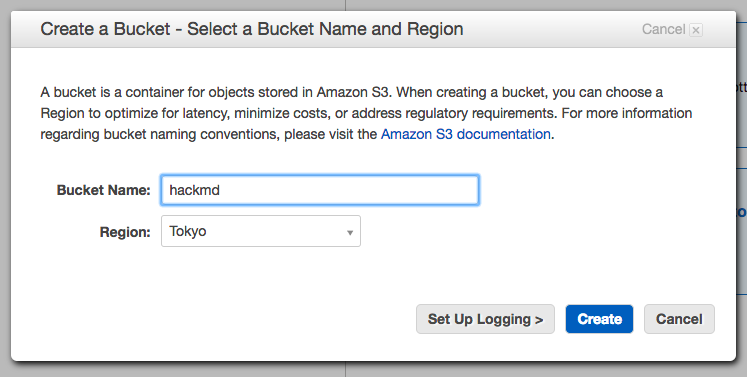
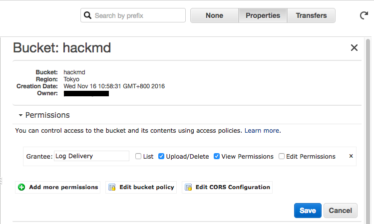
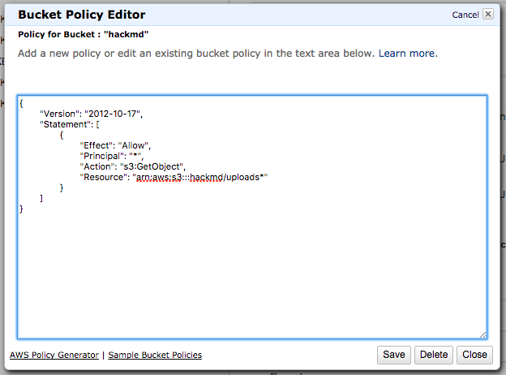
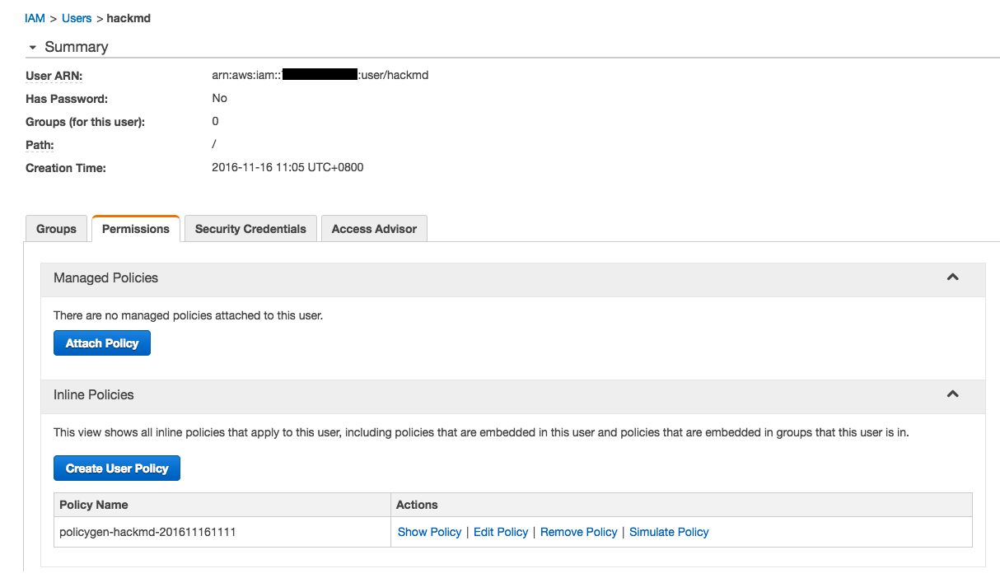
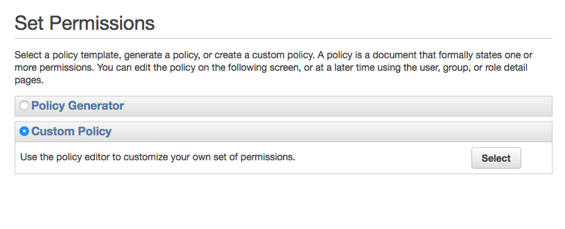
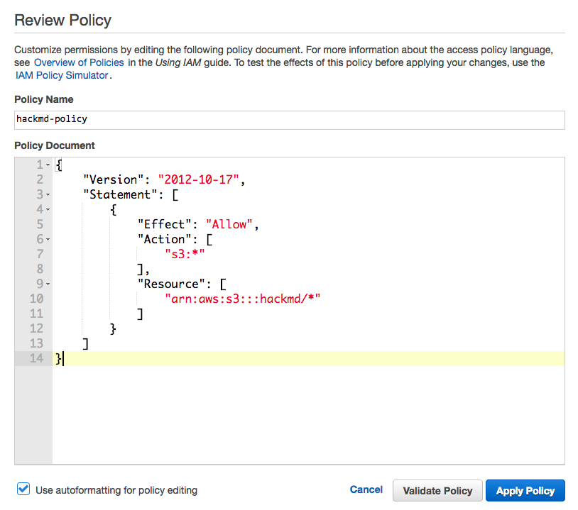

Guide - Setup CodiMD S3 image upload
===

**Note:** *This guide was written before the renaming. Just replace `HackMD` with `CodiMD` in your mind :smile: thanks!*

1. Go to [AWS S3 console](https://console.aws.amazon.com/s3/home) and create a new bucket.

    

2. Click on bucket, select **Properties**  on the side panel, and find **Permission** section. Click **Edit bucket policy**.

    

3. Enter the following policy, replace `bucket_name` with your bucket name:

    

    ```json
    {
        "Version": "2012-10-17",
        "Statement": [
            {
                "Effect": "Allow",
                "Principal": "*",
                "Action": "s3:GetObject",
                "Resource": "arn:aws:s3:::bucket_name/uploads/*"
            }
        ]
    }
    ```

4. Go to IAM console and create a new IAM user. Remember your user credentials(`key`/`access token`)

5. Enter user page, select **Permission** tab, look at **Inline Policies** section, and click **Create User Policy**

    

6. Select **Custom Policy**

    

7. Enter the following policy, replace `bucket_name` with your bucket name:

    

    ```json
    {
        "Version": "2012-10-17",
        "Statement": [
            {
                "Effect": "Allow",
                "Action": [
                    "s3:*"
                ],
                "Resource": [
                    "arn:aws:s3:::bucket_name/uploads/*"
                ]
            }
        ]
    }
    ```

8. Edit `config.json` and set following keys:

    ```javascript
    {
        "production": {
            ...
            "imageuploadtype": "s3",
            "s3": {
                "accessKeyId": "YOUR_S3_ACCESS_KEY_ID",
                "secretAccessKey": "YOUR_S3_ACCESS_KEY",
                "region": "YOUR_S3_REGION" // example: ap-northeast-1
            },
            "s3bucket": "YOUR_S3_BUCKET_NAME"
        }
    }
    ```

9. In additional to edit `config.json` directly, you could also try [environment variables](../configuration-env-vars.md).

## Related Tools

* [AWS Policy Generator](http://awspolicygen.s3.amazonaws.com/policygen.html)
